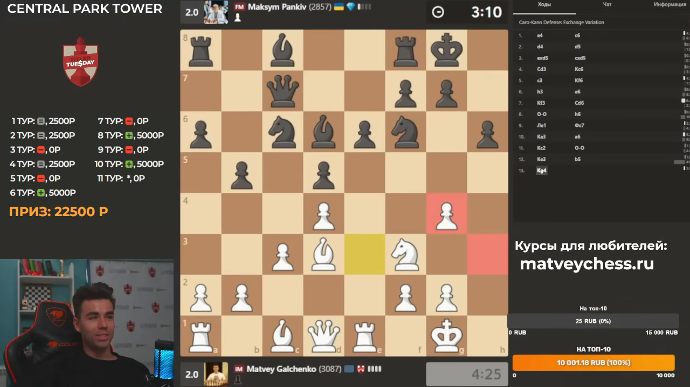

## Как пользоваться

- добавить новый **браузерный источник** в OBS с ссылкой на виджет
  (рекомендуемые размеры - 490x320)
- перед началом стрима установить "последнюю партию" по кнопке **Последняя**,
  включить **Авто**-загрузку всех новых партий
- _опционально можно_:
  - **стрелочками** сдвинуть "последнюю партию", если вдруг что-то сбилось
  - вручную тыкать на кнопку **Обновить** после каждой партии
  - скрыть/показать **Призовые** по соответствующей кнопке
  - добавить **Бонус** в призовые за "топ-30" в конце турнира

## Как это предположительно будет выглядеть

## Доп. информация

- Админ-панелька работает с телефона в том числе
- Автообновление результатов партий происходит 1 раз в минуту в фоне (админку
  можно закрыть); выключается само через 2 часа после начала
- Виджет никак не привязан именно к турнирам, в данный момент учитываются
  результаты всех типов партий из Архива партий с chess.com
